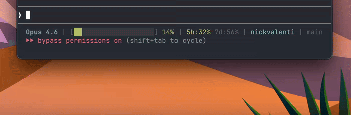

# murmur

AI-powered push-to-talk dictation for macOS (Apple Silicon). Hold a hotkey, speak, release. Polished text lands wherever your cursor is.

Transcription runs on-device via [mlx-whisper](https://github.com/ml-explore/mlx-examples), so no audio ever leaves your Mac. An LLM via [OpenRouter](https://openrouter.ai) cleans up the transcript: fixing punctuation, removing filler words, preserving your tone. Total API cost runs around $0.30/month at typical daily use: 50x cheaper than Wispr Flow ($15/month). Latency is 2-3 seconds end-to-end, comparable to Wispr Flow and significantly faster than other open-source alternatives that run Whisper on CPU.

 



---

## How it works

```
hold hotkey → record → release → transcribe (on-device) → polish (OpenRouter) → paste
```

- **Backend**: Python + FastAPI, runs locally on port 8765
- **Frontend**: SwiftUI menu-bar app, floating pill indicator, global hotkey
- **Transcription**: mlx-whisper (Whisper small, Apple Silicon optimised, ~400ms)
- **Polishing**: Any OpenRouter model (default: `google/gemini-2.5-flash-lite`, ~1s)

---

## Requirements

- macOS 13 Ventura or later, Apple Silicon (M1/M2/M3/M4)
- Python 3.12
- Xcode Command Line Tools
- An [OpenRouter](https://openrouter.ai) API key

Install Xcode CLT if you don't have it:

```bash
xcode-select --install
```

---

## Setup

### 1. Backend

```bash
cd backend
python3.12 -m venv .venv
source .venv/bin/activate
pip install -e .
```

First run downloads the Whisper model (~150 MB) to your Hugging Face cache.

Create `~/.murmur/config.json` and add your OpenRouter key:

```json
{
  "openrouter_api_key": "sk-or-..."
}
```

Or set it as an environment variable:

```bash
export OPENROUTER_API_KEY=sk-or-...
```

### 2. Build the app

```bash
cd mac
./build-app.sh
cp -R build/Murmur.app /Applications/
open /Applications/Murmur.app
```

The script compiles the Swift binary, assembles the `.app` bundle, and code-signs it.

---

## First-launch permissions

macOS will ask for two permissions:

### Microphone
Granted automatically on first recording attempt. Allow it when prompted.

### Accessibility (required for auto-paste)

Murmur simulates ⌘V to paste transcribed text into your focused app. macOS requires Accessibility permission for this.

> **Important — read this before granting Accessibility permission:**
>
> By default, `build-app.sh` signs the app with an ad-hoc signature (`--sign -`), which uses the binary's hash as its identity. **macOS ties Accessibility permission to this hash**, so every time you rebuild the app, macOS treats it as a new app and revokes the permission.
>
> **Fix: create a local code-signing certificate once.** This gives the app a stable identity that survives rebuilds.
>
> 1. Open **Keychain Access** → menu bar → **Keychain Access → Certificate Assistant → Create a Certificate**
> 2. Name: `Murmur Dev` · Identity Type: **Self Signed Root** · Certificate Type: **Code Signing**
> 3. Leave "Let me override defaults" **off** → click **Create**
> 4. Rebuild: `./build-app.sh && cp -R build/Murmur.app /Applications/`
> 5. Go to **System Settings → Privacy & Security → Accessibility**
> 6. Remove any existing Murmur entry (− button), then relaunch Murmur and grant permission
>
> After this one-time setup, Accessibility permission persists across all future rebuilds.

---

## Usage

- **Hold** your hotkey → pill appears at the bottom of your screen
- **Speak** → waveform animates with your voice
- **Release** → transcription + polishing runs (~1–2s depending on clip length)
- Text is pasted directly into whatever app was focused

### Changing the hotkey

Click the Murmur icon in the menu bar → **Settings** → click the hotkey button and press any key or combination. Supports bare keys (F5), combos (⌥Space), and modifier-only (fn, ⌥).

---

## Configuration

Config file: `~/.murmur/config.json`

| Key | Default | Description |
|-----|---------|-------------|
| `openrouter_api_key` | `""` | Your OpenRouter API key |
| `polishing_model` | `google/gemini-2.5-flash-lite` | Any OpenRouter model ID |
| `whisper_model` | `mlx-community/whisper-small-mlx` | mlx-whisper model |
| `polishing_prompt` | *(built-in)* | System prompt for polishing |

---

## Project structure

```
murmur/
├── backend/           # Python FastAPI server
│   ├── murmur/
│   │   ├── server.py  # HTTP endpoints
│   │   ├── audio.py   # Recording + RMS level
│   │   ├── transcribe.py
│   │   └── polish.py  # OpenRouter client
│   └── pyproject.toml
└── mac/               # SwiftUI app
    ├── Sources/Murmur/
    │   ├── AppDelegate.swift
    │   ├── PillController.swift   # State machine + window management
    │   ├── PillView.swift         # Floating indicator UI
    │   ├── Waveform.swift         # Animated audio bars
    │   ├── HotkeyManager.swift    # Global hotkey (Carbon)
    │   ├── BackendClient.swift    # HTTP client
    │   ├── BackendProcess.swift   # Spawns Python as child process
    │   └── Paster.swift           # CGEvent ⌘V simulation
    ├── Info.plist
    ├── build-app.sh
    └── AppIcon.icns
```

---

## Known issues

- **Auto-paste doesn't work after rebuilding** — see the Accessibility section above. Ad-hoc signing is the cause; the local certificate fix resolves it permanently.
- **Backend startup takes ~2s** — the Python server starts when Murmur launches. If you trigger the hotkey immediately on launch, you may get a "start failed" error. Wait a moment.
- **No cancel mid-recording** — releasing the hotkey always commits the transcription. Escape to cancel is not implemented yet.

---

## License

MIT
